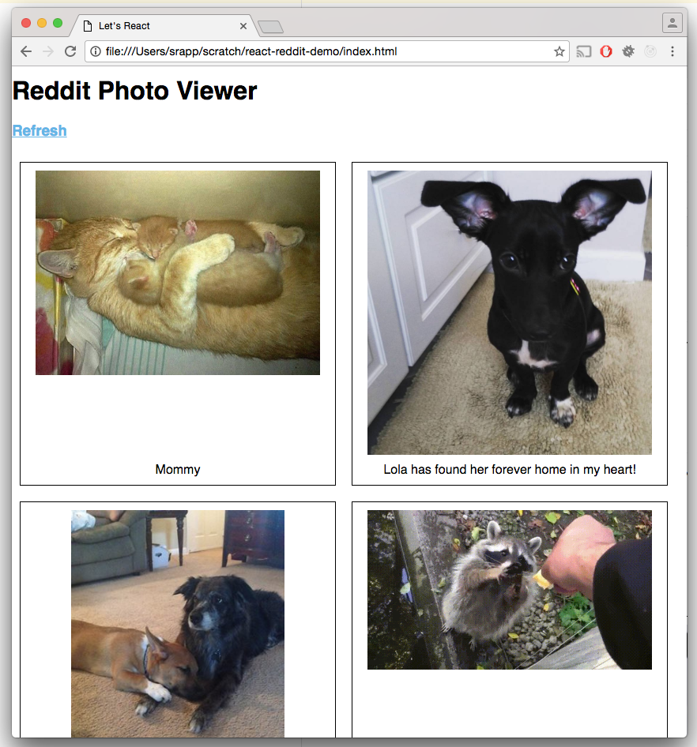
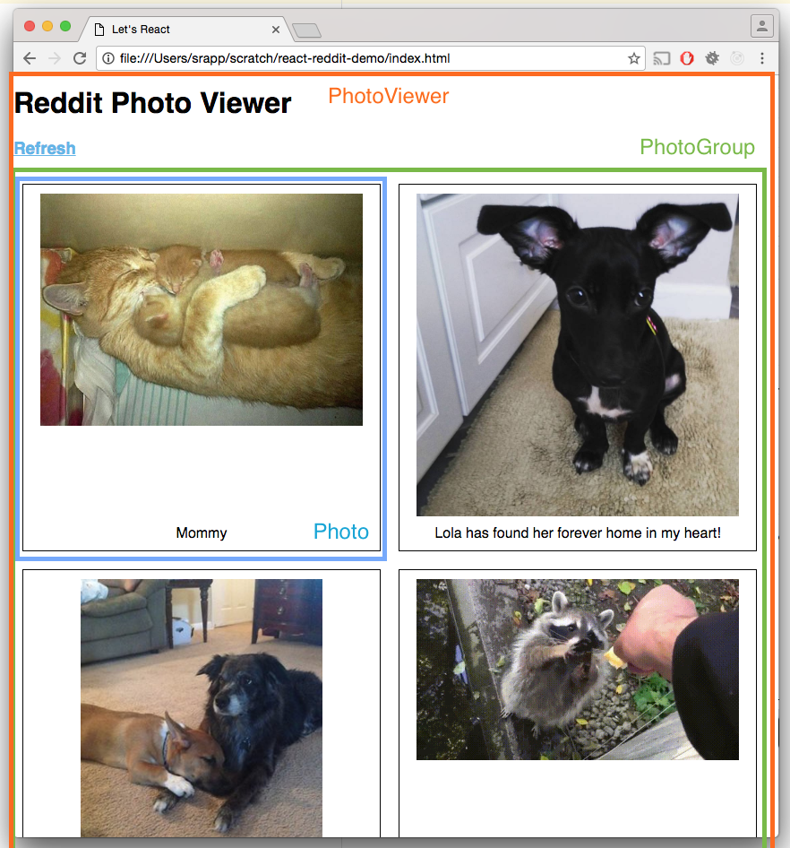

# Let's React: Reddit Photo Gallery

A simple application that renders a photo gallery based on a subreddit to demonstrate some of the basic principles of using React.

Heavily inspired by the [official React documentation](https://facebook.github.io/react/docs/hello-world.html).

## What are we gonna build?

A basic page that upon loading pulls some images from [/r/aww](https://www.reddit.com/r/aww/) and renders them in a flexible photo gallery.  You can check out the [finished product](/index.html) for yourself, but here's a look at what we're gonna build:



## What do we need?

For production apps that provide short load times, excellent user experiences, and all sorts of fancy things, there are a number of libraries we could get familiar with and use to build this app.  However, most of those are optional improvements that we don't need to get in the way of exploring React.

This project will be as light as possible, pulling in only the libraries we need to be productive in creating our application.  There's no build step, no bundling, and there's only one file to think about.  There's limitations to this approach, but it'll serve for our purpose.

## How are we going to build it?

### Break it down

One way to approach building an application in React is to identify the different components that make up your app.  We'll use these components as a guide to help us in the development process.  For this application, we can break it down like this:



We've identified three major components that we want to build: `Photo`, `PhotoGroup`, and `PhotoViewer`.  Depending on how this app evolves, we may break these components down into smaller components, especially when they become more complicated.  For instance, the `Photo` component could change to a container that holds an `Image` and `Caption` component.

### Make the State

It's good to get in the habit of thinking about the state of our application as a top-down data flow, where information is managed by top level components and passed down selectively to child components.  Many of these child components will be considered "dumb" or "presentational" components:  they'll be told the data they need to render and their job is to worry about how to render it.  Many components in a React application tend to be dumb components, which are smaller in scope and easy to test.  For more details, check out Dan Abramov's write up about [Presentational and Container Components](https://medium.com/@dan_abramov/smart-and-dumb-components-7ca2f9a7c7d0#.oms43mlik).

For this application, there's not a lot of state to hold on to.  We're basically going to need a list of image objects, each including a URL and a title.  So our state will end up looking something like this:

```js
{
	photos: [
		{ url: 'http://i.imgur.com/VjKeYOr.jpg', title: 'What a cute puppy!'},
		{ url: 'http://i.imgur.com/TycDgJU.jpg', title: 'What a cute cat!'},
		{ url: 'http://i.imgur.com/6BxbIIZ.jpg', title: 'What a good dog!'}
	]
}

```

## Step 0 - Setting Up

We have a pretty basic HTML page with a few additions:
* [Normalize.css](https://necolas.github.io/normalize.css/) and our own styling to set the `box-sizing` of all elements on the page establishes some consistency in our styling across browsers
* In the body, a single `<div>` which will be the target element we'll be modifying
* Below that, two linked script tags to include [React](https://facebook.github.io/react/docs/react-api.html) (the library we'll be using) and [ReactDOM](https://facebook.github.io/react/docs/react-dom.html) (supports rendering to a DOM)
	* These two libraries were originally combined, but eventually split out with the arrival of React Native, allowing React to power browser and mobile apps.
* An empty `<script>` block that we'll be using for writing our application code

[Step 0 source code](./step0.html)

## Step 1 - Hello World

We're ready to render something using React, let's introduce two new methods:
* [`React.createElement()`](https://facebook.github.io/react/docs/react-api.html#createelement) - let's us create an element based on a React component or a basic DOM element.  We're also able to pass down properties (known as `props`) and child elements.
* [`ReactDOM.render()`](https://facebook.github.io/react/docs/react-dom.html#render) - takes a React element and renders it into the DOM in the specified container.

[Step 1 source code](./step1.html)

## Step 2 - JSX and Babel

JSX is another way to create elements, similar in function to `React.createElement()`.  JSX has quickly become the standard for React, as it lends itself to more readable code, especially for those already familiar with HTML.  However, JSX isn't valid Javascript, so we need to transpile it before the browser processes it.  To do this, we use a tool called [Babel](https://babeljs.io/).

Typically, this is done as part of an offline build process, but for the sake of simplicity, we'll have the user's browser do it.  We'll embed a [standalone version](https://github.com/babel/babel-standalone) of Babel into the page, change to our script type to `text/babel`, and now we're ready to use JSX.

There are a number of differences between JSX and raw HTML.

[Step 2 source code](./step2.html)

## Step 3 - First Component

React components can be built in a number of ways, but we're going to use [`React.createClass()`](https://facebook.github.io/react/docs/react-api.html#createclass).

We'll start by filling out `render()`.  This function is what's called whenever React needs to draw your component.  This will occur whenever:
* The component is mounted (either directly or as a child of another component)
* The `props` passed to the component have changed
* The `state` of the component has changed

`render()` should return a single React element.  For our case, since we're using JSX, it'll look like we're just returning DOM elements.

[Step 3 source code](./step3.html)

## Step 4 - Inline Styles

We could set up some styles using CSS in the `<head>` portion of our file, but we're going to take advantage of JSX inline styles.  It's another way of accomplishing the same thing, but it allows for some nifty features and testable code (for instance, dynamically adjusting colors based on hexcodes being passed in as props)

[Step 4 source code](./step4.html)

## Step 5 - Props

We hardcoded the image url and title in our first component, but we want to be able to reuse this as a building block in our application.  We can parameterize it by introducing `props`.

[`props`](https://facebook.github.io/react/docs/components-and-props.html) are arbitrary inputs that can be passed to a component.  From the perspective of the component, they should be considered read-only and should not modify them when handling them, as parent components may change the values being sent without warning.  Later, we'll introduce `state`, a mutable data representation for components.

We update `ReactDOM.render()` to pass in the same hardcoded values as props to demonstrate the reusable nature of this component.

[Step 5 source code](./step5.html)

## Step 6 - PhotoGroup Component

Now it's time for our second presentational component, the `PhotoGroup`.  This goal here is to create a component that takes a list of photo objects as a prop and render multiple `Photo` elements in a responsive arrangement.  We do a couple of things to accomplish this:
* Define a new React component `React.createClass()`
* For simplicity while we develop, we introduce [`getDefaultProps()`](https://facebook.github.io/react/docs/react-without-es6.html#declaring-prop-types-and-default-props) to set up some default values
* We set up some inline styles to take advantage of [Flexbox](https://developer.mozilla.org/en-US/docs/Web/CSS/CSS_Flexible_Box_Layout/Using_CSS_flexible_boxes)
* We define `render()` to return a `<div>` with a header and multiple `Photo`s through composition.  `PhotoGroup` is now responsible for providing props to its `Photo` children.
* For now, we hard code rendering the first element of the list over and over so we can examine that the component renders its child elements appropriately.

[Step 6 source code](./step6.html)

## Step 7 - Mapping Lists

We're not quite done with the `PhotoGroup` component.  We want to take the list of photo objects it takes as a prop and turn those into `Photo` elements.  We can accomplish this by calling `map()` on the list we get passed in and transforming those objects into `Photo` elements.

When doing this, sort of transform, React warns us to provide the `key` prop to these elements we're generating.  [Keys](https://facebook.github.io/react/docs/lists-and-keys.html) are used internally by React to help keep track of individual elements generating dynamically as part of a group so that it can keep track of changes, additions, and removals.  Some things to consider when selecting a key:
* Keys must be unique among siblings, but don't have to be universally unique
* Keys should represent a stable identity.  For instance, using IDs that come from the data being rendered is often a quick solution
* Less ideal is using the index of the item in the list.  This isn't recommended for items that can be reordered, as it can lead to slower performance during rendering

JSX allows the [embedding of Javascript](https://facebook.github.io/react/docs/introducing-jsx.html#embedding-expressions-in-jsx) expressions directly into elements.  In this case, we'll store the result of the mapping into a variable within `render()` and refer to it within the JSX.

[Step 7 source code](./step7.html)

## Step 8 - Top Level Component

We're going to build our final component, the `PhotoViewer`.  This is where we'll house and manage the `state` of our application.  `state` is the mutable data that can be stored within a component.  There are a couple of things to consider when using `state`:
* State is a basic javascript object that components have access to via `this.state`.
* State should not be directly modified through changing the object stored in `this.state`.  Instead [`this.setState()`](https://facebook.github.io/react/docs/react-component.html#setstate) should be used to update the fields within `state`, because there are other downstream effects that React wants to handle when `state` changes.
* `setState()` performs a shallow merge of the object you pass as a parameter into the current state.  Attributes defined in `state` but not in the argument passed to `setState()` will not be modified.
* `setState()` should be treated as if it's asynchronous, as state propegation may take a moment to flow through the application.  You can pass a second optional parameter as a callback function if you need to do something after `state` has been updated and the component has re-rendered.
* `getInitialState()` is a function that defines what `state` should initialize to and can be useful for testing while developing.

We can set up `PhotoViewer` just like we did our other components.  We set up an initial state by defining `getInitialState()` and fill in some mock data.  Then we define `render()` to reference `state` and pass down the appropriate values to `PhotoGroup`.

[Step 8 source code](./step8.html)

## Step 9 - Fetch the Data

We have a mostly functioning application built out, but at this point, it's basically a glorified static page.  It's time to make it dynamic by fetching data from an API.  To do this, we're going to utilize the [Fetch API](https://developer.mozilla.org/en-US/docs/Web/API/Fetch_API).  `fetch()` is something that's still in flux and not available in all browsers natively just yet, but it's supported in Chrome and should serve for our purposes in this project.

Note: You can use any browser request library you prefer: [JQuery](https://jquery.com/), [superagent](https://github.com/visionmedia/superagent), even just native [XMLHttpRequests](https://developer.mozilla.org/en-US/docs/Web/API/XMLHttpRequest/Using_XMLHttpRequest).  The plumbing might be a little different, but whatever works well for you should work well with React.

The Fetch API also utilizes [promises](https://developer.mozilla.org/en-US/docs/Web/JavaScript/Reference/Global_Objects/Promise) as a way to abstract the asynchronous part of the request.

At this point, before we hook everything up to React, we'll print out the results of our API request to the console.  The hotkey to open the console in Chrome running on a Mac is `command` + `option` + `j` by default.  This is where we'll see the results of the API call appear for now.

[Step 9 source code](./step9.html)

## Step 10 - Setting State

We're now ready to use our new data fetching function in our React code, but where do wire it in?  In this case, we want to immediately fetch the data when the application is loaded, so we'll tie into one of React's [Component Lifecycle Methods](https://facebook.github.io/react/docs/react-component.html#the-component-lifecycle).  There are a number of them and they vary in usefulness, but the one we're looking to use is `componentWillMount()`, which is fired before a component is mounted (initially rendered) into the DOM.

Within the lifecycle method, we'll dispatch our API call and wire it up with a callback to `this.setState()`, where we can update the component's `state` with the results of the request.  Now when we load the page:
1. We immediately kick off the API request
1. When that request completes, `setState()` is called
1. `PhotoViewer`'s state is updated and it's asked to re-render, calling its `render()` function
1. This in turn passes different props to `PhotoGroup`, prompting it to re-render as well
1. This continues to cascade down to the `Photo` elements, creating or updating for each object we retrieved from the API

Now we have a fully functional application.  There's a few things we can do to make it a little better for our users

[Step 10 source code](./step10.html)

## Step 11 - Loading Time

When the application initially loads, you may notice that we don't display very much while we're waiting for a response from the API.  It'd be nice if we could tell the user that we're doing work on their behalf and show them a loading message.  To do that, we need to represent that loading in our state.  For simplicity, we'll use `null` to represent that the list of photos has not been received yet, though a separate `isLoading` flag is probably the more appropriate long-term solution.

Now we need to change our components to handle `null` values, or else we'll get a null pointer exception.  We can use Javascript's [logical operators](https://developer.mozilla.org/en-US/docs/Web/JavaScript/Reference/Operators/Logical_Operators) (specifically `&&`) to conditionally render the photos.  We can do something similar for our loading message as well.  The reason this works is that [React doesn't render falsey values](https://facebook.github.io/react/docs/conditional-rendering.html).

[Step 11 source code](./step11.html)

## Step 12 - Refresh

Finally, we want to provide a way for users to refresh the data of the application without reloading the entire page.  To do so, we'll utilize the built in [React Event Handlers](https://facebook.github.io/react/docs/handling-events.html) to set up a `<div>` that calls a function when clicked.  Once we do that, we simple refactor our API call from `componentWillMount()` into its own function and pass that in to the `onClick` handler of our refresh link.

[Step 12 source code](./step12.html)
